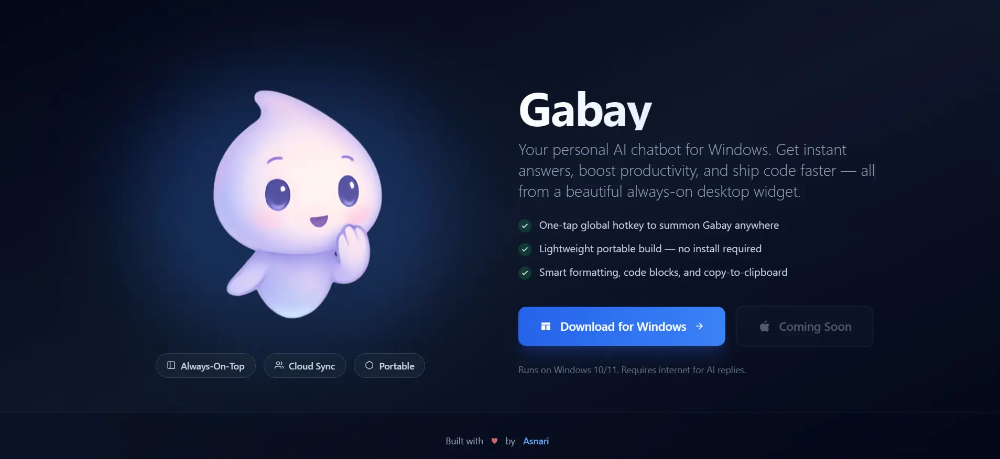

# Gabay

A personal AI chatbot for Windows. Get instant answers, boost productivity, and ship code faster — all from a beautiful always-on desktop widget.



[Try Gabay Online](https://gabay-chatbot.vercel.app/)

## Features

- **Global Hotkey** - Press `Ctrl+L` to summon Gabay anywhere
- **Portable** - Single exe file, no installation wizard needed
- **Smart Formatting** - Code blocks, markdown, and copy-to-clipboard
- **Cloud Sync** - Save and sync chat history with Supabase
- **File Uploads** - Attach images and documents for AI analysis
- **Always-on-Top** - Floating window that stays accessible
- **System Tray** - Minimize to tray, runs quietly in background

## Download

[**Download for Windows**](https://github.com/Kyaa-A/gabay/releases/latest/download/Gabay.1.0.0.exe)

Requires Windows 10/11 and internet connection for AI responses.

## Quick Start

1. Download and run `Gabay.1.0.0.exe`
2. Click the settings icon (gear) and enter your [Google AI API key](https://aistudio.google.com/apikey)
3. Press `Ctrl+L` to toggle the chatbot window

## Development

```bash
# Install dependencies
npm install

# Start development server
npm start

# Build for production
npm run electron-build
```

## Tech Stack

- **Frontend**: React 18, Tailwind CSS
- **Desktop**: Electron 27
- **AI**: Google Gemini API
- **Auth & Sync**: Supabase (optional)

## License

MIT License

---

Built with love by [Asnari](https://www.asnari.tech/)
